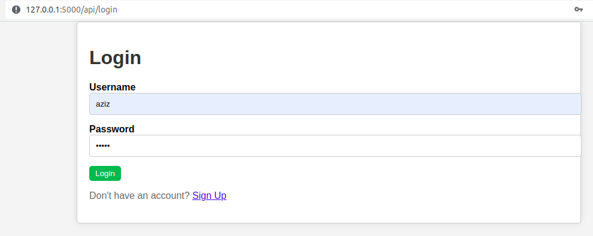
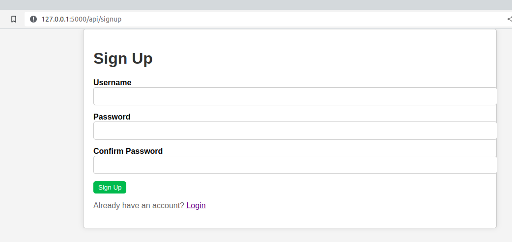
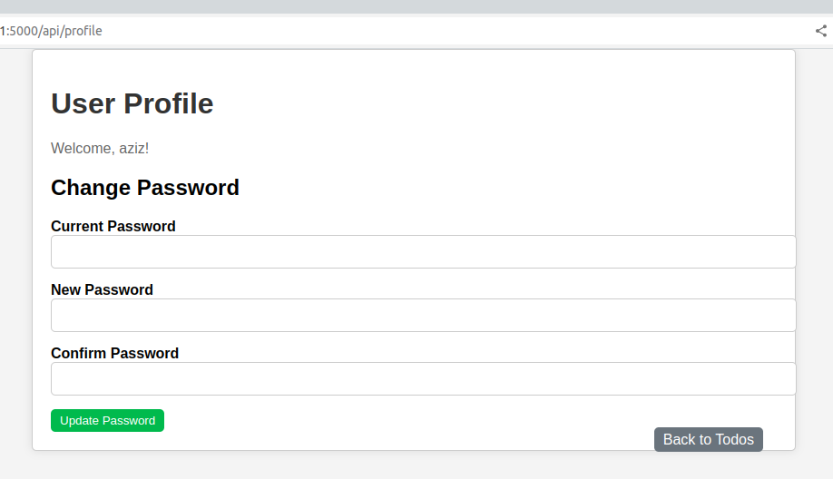
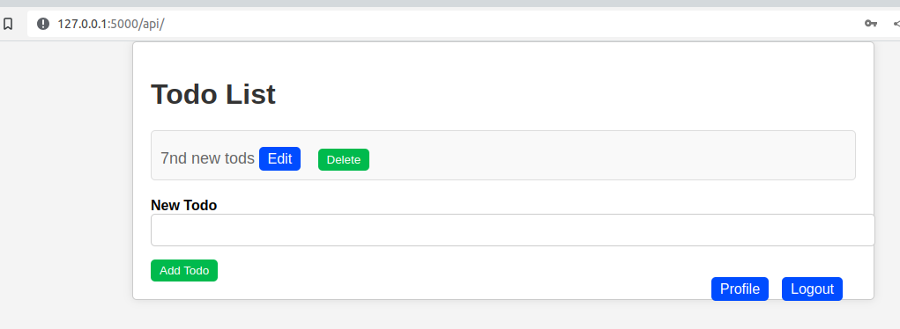
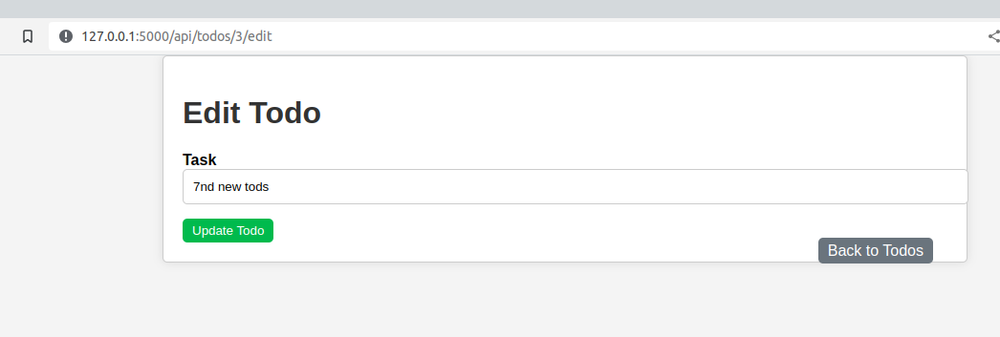

# flask-crud-mysql
Flask crud (create, read, update, delete) application with mysql database in localhost

A simple python application of Todo List using Flask

## Login

## Signup

## Profile

## Todo list

## Edit Todo list

